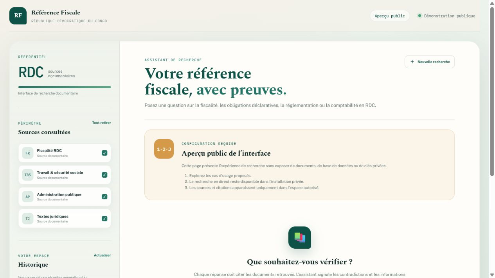
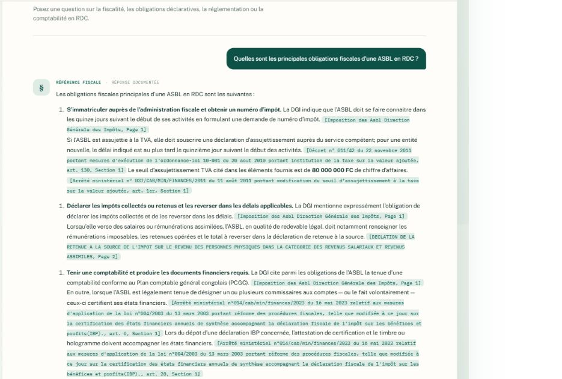
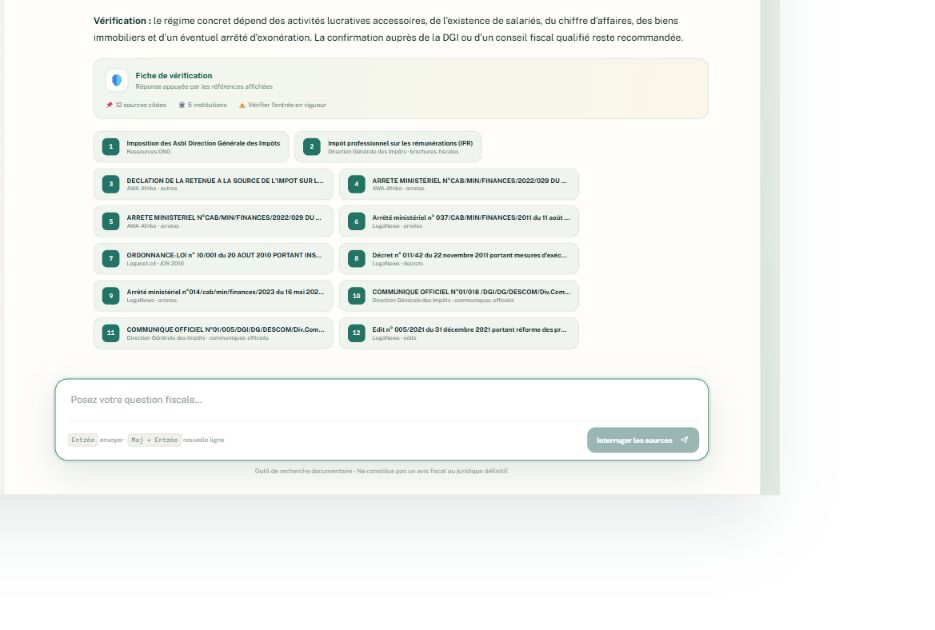
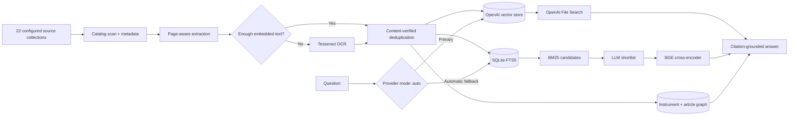

<div align="center">

# Référence Fiscale RDC

**Citation-first research for fiscal, legal, accounting, customs, monetary,
and employment law in the Democratic Republic of Congo.**

Ask in French. Retrieve the underlying text. Answer with document, article,
page, and original-source citations.

[](https://github.com/zanestor/RAG-Fiscal-Assist/actions/workflows/ci.yml)
[](https://github.com/zanestor/RAG-Fiscal-Assist/actions/workflows/ci.yml)
[](LICENSE)

[**Explore the interface**](https://zanestor.github.io/RAG-Fiscal-Assist/)
· [Quick start](#quick-start)
· [Architecture](#how-retrieval-works)
· [Security](SECURITY.md)

</div>

> [!IMPORTANT]
> The public repository contains the application and configuration templates,
> not the private document corpus, extracted evidence, indexes, API keys, or
> chat history. The GitHub Pages experience is a static, data-free interface
> preview and cannot answer questions.

[](https://zanestor.github.io/RAG-Fiscal-Assist/)

<p align="center"><sub>Public preview mode — no corpus, database, or API credentials are exposed.</sub></p>

## From a suggested question to a cited result

Selecting **“Obligations d’une ASBL — Impôts, déclarations et pièces
justificatives”** submits the example question and replaces the welcome panel
with a structured answer. Citations remain visually attached to the claims
they support.



### References and verification summary

At the end of the response, the assistant displays its verification card and
the complete list of references used for the answer.



> [!NOTE]
> This example was captured from the private development index on 25 August
> 2026. It demonstrates the interface and citation flow; fiscal applicability
> and legal force must still be verified for the entity and date concerned.

## Why this exists

Fiscal and legal research in the DRC means cross-referencing Journaux
Officiels, ministry publications, professional libraries, and legislative
aggregators with uneven formatting, OCR quality, metadata, and duplication.
Référence Fiscale RDC turns those collections into one searchable evidence
layer designed to ground material claims in the actual text of the law.

The assistant does **not** train a model on the documents. It extracts
page-aware evidence, builds searchable indexes, retrieves the smallest useful
set of passages, and attaches traceable citations to the generated answer.

## What it brings together

| Capability | Practical value |
| --- | --- |
| **Citation-first answers** | Links substantive claims to a document, article, original PDF page, and online source when available. |
| **Dual retrieval** | Uses OpenAI hosted File Search first and automatically falls back to local SQLite FTS5/BM25 retrieval with OpenRouter. |
| **Legal relationship graph** | Tracks amendments, repeals, replacements, and article-level relationships separately from generative reasoning. |
| **Legal-aware chunking** | Preserves article identity across pages and keeps distinct articles separate even when they share a PDF page. |
| **OCR-aware ingestion** | Applies Tesseract only where embedded page text is insufficient and records unresolved pages for review. |
| **Three-pass deduplication** | Detects byte-identical files, identical normalized evidence, and title candidates confirmed by content. |
| **Resilient citations** | Keeps original-source links, mirror provenance, and page locators through local and hosted retrieval paths. |
| **Private local history** | Stores conversations in a local SQLite database and supports full-chat PDF export with clickable sources. |

## How retrieval works



With `FISCAL_RAG_PROVIDER=auto`, the server uses OpenAI when a key and hosted
index are ready. If that path is unavailable or fails, a circuit breaker
temporarily routes questions through the private local index, optional LLM
shortlisting, the multilingual `BAAI/bge-reranker-v2-m3` cross-encoder, and
OpenRouter. Each reranking stage fails open to the preceding ranking.

## Development corpus snapshot

These figures describe one private development deployment on **24 August
2026**. They are operational measurements, not data bundled with this
repository.

| Configured collections | Documents discovered | Eligible documents locally covered | Local retrieval chunks |
| :---: | :---: | :---: | :---: |
| **22** | **12,292** | **11,451 / 11,490 (99.66%)** | **378,245** |

The same snapshot contains 3,677 legal instruments, 423 instrument-level
relationships, 913 parsed articles, and 1,353 article-level relationships.

## Quick start

### Preview the interface without a corpus

```powershell
python -m http.server 8011 --bind 127.0.0.1 --directory static
# Open http://127.0.0.1:8011/?demo=1
```

This is the same sanitized mode published to GitHub Pages. Search controls are
intentionally disabled because no documents or API are connected.

### Run the complete assistant on Windows

1. Run `Setup Fiscal Assistant.cmd` to create `.venv`, install dependencies,
   and create `.env` from the template.
2. Configure at least one source folder in
   [`config/sources.json`](config/sources.json), and add `OPENAI_API_KEY`
   and/or `OPENROUTER_API_KEY` to `.env`.
3. Build a five-document smoke index, inspect status, then start the server:

   ```powershell
   .\.venv\Scripts\python.exe cli.py index-local --limit 5
   .\.venv\Scripts\python.exe cli.py status
   .\.venv\Scripts\python.exe server.py
   ```

4. Open <http://127.0.0.1:8010>. Once the smoke test is sound, run
   `python cli.py index` for all eligible documents and configured providers.

The indexing pipeline checkpoints progress and is safe to resume. A fresh
public clone will discover nothing until source documents or source paths are
configured; this is intentional.

## Repository guide

| Path | Purpose |
| --- | --- |
| [`fiscal_rag/`](fiscal_rag) | Catalog, extraction, indexing, retrieval, reranking, legal graph, assistant, and history modules. |
| [`static/`](static) | Responsive French web interface and data-free GitHub Pages preview. |
| [`config/sources.json`](config/sources.json) | Source collection definitions, metadata catalogs, title overrides, and review gates. |
| [`cli.py`](cli.py) | Corpus lifecycle, indexing, deduplication, graph, status, and learning commands. |
| [`server.py`](server.py) | Local HTTP server for status, chat, history, and guarded document access. |
| [`tests/`](tests) | Retrieval, extraction, deduplication, indexing, graph, API, and state regression tests. |
| [`SECURITY.md`](SECURITY.md) | Public-repository and deployment security boundaries. |

## Configured source collections

The configuration currently defines **22 enabled collection feeds**. A feed
is not necessarily a separate institution: for example, LegaNews text and
attachments are indexed independently.

<details>
<summary><strong>See the configured collections</strong></summary>

| Group | Collections |
| --- | --- |
| **Public authorities** | Ministère du Budget, Banque Centrale du Congo, DGI, DGRAD, Ministère des Finances, ONEC-RDC, ONEM, CNSS, ANICNS |
| **Legal and professional sources** | AWA-Afrika, OHADA/SYSCOHADA, LegaNews, LegaNews attachments, Leganet.cd, Droit Congolais, Lextenso |
| **International and specialist libraries** | NATLEX, FAOLEX, Congo Mines, Scribd Journaux Officiels |
| **Curated document libraries** | Ressources ONG, Government & Public Affairs |

</details>

The external Government & Public Affairs collection supports PDF, DOCX,
XLSX, XLS, CSV, and TXT evidence. It is inventory-visible but protected by a
`review_all` gate: extraction and upload require an explicit
`--include-review-required` opt-in after authorization and privacy review.
Images, videos, archives, scripts, and logs are intentionally excluded.

## Security and data boundary

Keep `.env`, API keys, downloaded documents, extracted text, `state.json`,
SQLite databases, chat history, generated reports, and internal paths outside
Git. Private locations belong in environment variables such as
`FISCAL_RAG_GPA_PATH`; see [SECURITY.md](SECURITY.md) before publishing or
deploying the application.

The included server binds to localhost and is intended for trusted local use.
It is not a production internet deployment template: authentication, TLS,
rate limiting, audit logging, and an approved retention policy are required
before exposing a live corpus.

Every push and pull request runs Python tests, a browser JavaScript syntax
check, and whitespace validation through GitHub Actions.

## Corpus operations

Edit [`config/sources.json`](config/sources.json) to add another folder or
catalog. Paths may be relative to the parent workspace or supplied through an
environment variable. Folders can be nested. CSV catalogs are optional; when
present, common title, URL, category, filename, and date columns are detected
automatically. Use an `extensions` list to opt into non-PDF document types.

### Adding a new source, step by step

This is the exact sequence used to bring a new scraper's output online (the
`cnss` source was added this way) or to point at an existing document folder
that lives outside this workspace (the `ohada` source was added this way):

1. **Place or point at the files.** Two cases:
   - **A scraper's output, inside `Scapper/`:** put it under a new folder
     directly inside `Scapper/` (a sibling of `awa_scraper/`), e.g.
     `Scapper/cnss/downloads/`. PDFs can be organized into category
     subfolders (`downloads/lois-et-decrets/`, `downloads/communiques/`,
     ...) — the scan is recursive. If the scraper also saves its own `.txt`
     sidecars (OCR/extraction byproducts, not a distinct source of truth),
     leave the source's `extensions` at the default `[".pdf"]` so they
     aren't double-indexed as separate documents.
   - **An existing folder outside this workspace** (a shared drive, another
     OneDrive location, ...): do **not** hardcode its absolute path into
     `config/sources.json` — that file is committed to the (now public)
     repo, and a raw local path leaks your folder structure and username.
     Instead add a placeholder env var, e.g. `FISCAL_RAG_OHADA_PATH=`, to
     both `.env` (the real path) and `.env.example` (empty, documenting the
     variable's existence), then reference it in `sources.json` as
     `"paths": ["%FISCAL_RAG_OHADA_PATH%"]` — `_resolve_config_path()` in
     `config.py` expands it at load time. This is the same pattern already
     used for `government_public_affairs`.

2. **(Optional) Point at a catalog CSV** if the scraper produced one with
   per-document metadata. `catalog.py` auto-detects common column names —
   `full_name`/`website_title`/`title`/`name` for the title, `pdf_filename`
   for the matching PDF, plus category/date/URL columns when present. This is
   what supplies each citation's real, clickable `source_url` (the online
   original), not just the local file path. A source pointed at an external
   folder with no catalog (like `ohada`) simply omits `catalogs` — citations
   still work, they just won't have an online `source_url`.

   If a catalog row is known to carry the parent web page's title instead of
   the PDF's real title, add a filename-scoped `title_overrides` mapping to the
   source configuration. Metadata-only corrections refresh the synthetic
   extraction header without discarding an existing OCR evidence body.

3. **Add an entry to `config/sources.json`**:

   ```json
   {
     "id": "cnss",
     "label": "CNSS",
     "description": "Caisse Nationale de Sécurité Sociale : lois et décrets, communiqués, formulaires employeur/travailleur et publications",
     "paths": ["cnss/downloads"],
     "catalogs": ["cnss/output/text_name_mapping_cnss.csv"],
     "enabled": true
   }
   ```

   `id` must be unique and stable — it's used as the source filter key
   throughout the app and API. For a source needing privacy review before any
   document is uploaded (personal data, internal-only files), follow the
   `government_public_affairs` pattern instead: add `"review_all": true` and
   list the extensions that need review under `"review_extensions"`. A folder
   that mixes public reference material with what look like internal working
   files (accounting spreadsheets, internal financial statements, training
   slides) is exactly this case — leaving `extensions` at the PDF-only
   default and reviewing before ever opting into `.xlsx`/`.docx`/`.pptx` is
   the safe starting point, not an afterthought.

4. **Bring it online** from the repository directory:

   ```powershell
   # Discover the new documents (also runs automatically at the start of prepare/index)
   python cli.py scan

   # Extract text, with OCR for scanned pages
   python cli.py prepare --ocr --source cnss --workers 4

   # Index to both the OpenAI hosted store and the local fallback
   python cli.py index --source cnss --workers 4

   # Confirm it's picked up
   python cli.py status
   ```

   `--source` can be repeated to bring up several new sources in one command.
   Scope every command to the new source id while testing — indexing the
   whole corpus by accident is slow and unnecessary for a one-source addition.

5. **Restart `server.py`.** The source list, like all of `Settings`, is read
   once at process startup — a running server won't see a newly-added source
   (or filter it from `/api/status`) until it restarts. Static frontend files
   (`static/*`) are served fresh from disk on every request and never need a
   restart.

6. **Check for duplicates.** A new source often re-supplies laws already
   present from other sources (or duplicates within itself — identical files
   saved under different names). Run `python cli.py dedupe` (dry-run) after
   indexing and review the preview before `--apply`; see "Deduplicating the
   corpus" below.

### Removing a source

There is no single `cli.py` command that purges a source in one step; which
approach to use depends on whether the goal is to stop it growing or to
actually remove its documents from search.

**To stop a source from being discovered or shown** (the common case — e.g.
a scraper is being retired, or content shouldn't be offered to users
anymore), set it to disabled in `config/sources.json` and restart the server:

```json
{ "id": "cnss", ..., "enabled": false }
```

This is quick and reversible. `scan()` will no longer discover new documents
for it, and it disappears from the sidebar's source filter. **It does not by
itself remove documents already indexed** — a disabled source's existing
records are simply left alone (not marked absent), so anything already
uploaded to the OpenAI vector store or written into the local SQLite index
stays searchable until a full rebuild.

**To actually remove its documents from both indexes**, remove its entry
from `config/sources.json` (and delete or move its folder, so nothing
resurrects it on the next scan), then rebuild both indexes from scratch so
the removed documents are no longer discovered and get dropped:

```powershell
# Stop the server first - it holds the local index file open
Remove-Item "$env:LOCALAPPDATA\RAF_Fiscal_Assistant\local_retrieval.sqlite3*"
python cli.py index-local
```

For the **OpenAI hosted vector store**, note that this local rebuild does
**not** retroactively delete the removed source's files from OpenAI's side —
`index()` only deletes a remote file when it's replacing that same document
with a changed version, not when a document stops being discovered at all.
Removing a source's files from the OpenAI vector store itself currently
requires either deleting them individually via the OpenAI API/dashboard
(`state.json`'s `openai_file_id` per document, before you remove its
records) or recreating the vector store and re-running `python cli.py index`
against the smaller, updated source list. Treat this step deliberately —
deleting from a live vector store is not easily reversible.

## First-time setup on Windows

1. Double-click `Setup Fiscal Assistant.cmd`.
2. Open the generated `.env` file and add one or both keys:

   ```text
   OPENAI_API_KEY=your-openai-key
   OPENROUTER_API_KEY=your-openrouter-key
   ```

   The key is read only by Python. It is excluded from source control and is
   never included in the browser JavaScript. Because this project is inside a
   OneDrive folder, use a user-level environment variable instead of `.env` if
   organizational policy prohibits syncing API credentials.

3. Test five documents in the local fallback index before starting the full index:

   ```powershell
   .\.venv\Scripts\python.exe cli.py index-local --limit 5
   ```

4. Build every available index. Without a funded OpenAI key, this still keeps
   the local/OpenRouter fallback usable:

   ```powershell
   .\.venv\Scripts\python.exe cli.py index
   ```

5. Double-click `Open Fiscal Assistant.cmd` and verify the retrieved citations.

The process saves progress after every document and is safe to restart.

## Provider configuration

```text
FISCAL_RAG_PROVIDER=auto
FISCAL_RAG_FALLBACK_ENABLED=true
FISCAL_RAG_HISTORY_ENABLED=true
FISCAL_RAG_DATA_DIR=%LOCALAPPDATA%\RAF_Fiscal_Assistant
FISCAL_RAG_OPENAI_MODEL=gpt-5.6-terra
FISCAL_RAG_OPENROUTER_MODEL=openai/gpt-5.6-terra
FISCAL_RAG_OPENROUTER_DATA_COLLECTION=deny
```

Provider modes are `auto`, `openai`, and `openrouter`. `auto` is recommended.
OpenAI failures open a five-minute circuit before the server retries the
primary provider. Set `FISCAL_RAG_OPENAI_RETRY_SECONDS` to change this delay.

`FISCAL_RAG_OPENROUTER_DATA_COLLECTION=deny` restricts OpenRouter routing to
providers that do not collect data. `FISCAL_RAG_OPENROUTER_ZDR=true` can impose
the stricter zero-data-retention filter, but may reduce provider availability.
The generated state and SQLite files use `%LOCALAPPDATA%` because mutable
databases and atomic state files can hang inside a OneDrive placeholder folder.

## Local chat history

Conversation history is enabled with `FISCAL_RAG_HISTORY_ENABLED=true` and is
stored in `%LOCALAPPDATA%\RAF_Fiscal_Assistant\chat_history.sqlite3`. The local
database contains the user's questions, generated answers, model/provider
labels, and citation references. Retrieved context passages are not copied into
the history database. Conversations can be reopened or permanently deleted
from the History section in the application sidebar. Set the option to `false`
and restart the server to disable history persistence.

## Commands

```powershell
# Discover all configured PDFs; no extraction and no API calls
python cli.py scan

# Extract page-aware text locally; no API calls
python cli.py prepare

# Try OCR for pages with little embedded text (requires Tesseract + fra/eng data)
powershell -ExecutionPolicy Bypass -File .\setup_ocr_languages.ps1
python cli.py prepare --ocr

# Prepare and upload changed documents
python cli.py index

# Verify/synchronize the reviewed, hash-pinned official Budget 2026 documents
python scripts/sync_official_budget_documents.py --dry-run
python scripts/sync_official_budget_documents.py --check
python scripts/sync_official_budget_documents.py

# Build only the private local retrieval index used by OpenRouter
python cli.py index-local

# Small end-to-end indexing test
python cli.py index --limit 5

# Index one institution first (source IDs are defined in config/sources.json)
python cli.py index --source dgi

# Rebuild the structured legal graph (instrument-level, then article-level)
python cli.py legal-build
python cli.py article-graph-build

# Preview which documents are redundant copies of the same instrument (safe, no changes)
python cli.py dedupe

# Actually mark duplicates and delete their OpenAI files/local index rows
python cli.py dedupe --apply

# Display inventory/index status
python cli.py status

# Test OpenRouter safely with fabricated content only
python scripts/smoke_openrouter_fallback.py

# Start the web application
python server.py
```

## Updating the knowledge base

After any scraper downloads new or changed PDFs, run `cli.py index` again.
Unchanged extracted and indexed documents are skipped. The local fallback is
built first. When OpenAI is configured, changed documents are then uploaded;
only after a replacement succeeds does the application try to delete the
previous remote file.

The local state, extracted text, and SQLite retrieval database live under
`%LOCALAPPDATA%\RAF_Fiscal_Assistant` by default. They are generated artifacts,
not source files. The OpenAI vector store remains available until it is deleted
through the OpenAI platform or API.

### Deduplicating the corpus

The same real-world law is routinely scraped by several sources (droitcongolais,
leganews, leganet, dgrad, ...), and heavy duplication dilutes `file_search`
ranking - a genuinely relevant document can lose to a dozen near-identical
copies of itself competing for the same result slots. `python cli.py dedupe`
groups documents that are the same instrument, keeps one canonical copy (source
priority - official/primary sources first - then extraction quality), and
removes the rest from the local index and the OpenAI vector store.

Three independent passes feed the same report, in order:

1. **Exact match (sha256).** `find_exact_duplicate_groups()` groups
   document_ids whose raw file content is byte-identical - literally the same
   PDF saved under a different name, path, or source. No title parsing and no
   similarity threshold: an exact hash match already proves identity, so this
   is a zero-ambiguity signal. It exists because pass 2 below structurally
   cannot catch this case - a document whose title doesn't follow the
   corpus's "Type n DATE ..." citation convention (an informally named
   upload, training material, a manually re-saved copy) never enters that
   candidate pool at all, no matter how identical its content is to another
   document's. Confirmed live: adding a source of manually-collected OHADA
   accounting references surfaced 248 exact-duplicate groups (272 documents)
   across the *entire* corpus - none of them title-parseable, none of them
   caught by pass 3 - including copies that predated that source (the same
   file re-scraped under different sources/names, e.g. an AWA copy and an
   OHADA copy of the exact same PDF).

2. **Exact extracted-evidence match.** Different PDF binaries can still
   produce exactly the same normalized operative text (for example, a PDF
   re-encoded by another website under a generic title). This pass strips the
   pipeline metadata and compares exact normalized evidence, so it catches
   those copies without using a fuzzy threshold. Similar but changed editions
   remain separate.

3. **Title + content match.** Title-based first (via the same
   instrument-identity parser used by the legal graph) but **not** applied on
   title alone: many implementing decrees open their title with a citation to
   the base law they apply ("Loi n 015/2002 ... Code du Travail, specialement
   en son article 169 ; Vu ..."), so title agreement alone would merge
   distinct documents. A second, content-based gate (word-shingle similarity,
   comparing each document's text from its first "Article" onward) confirms
   two candidates are actually the same writing before either is touched -
   calibrated to lean toward under-merging over over-merging, since an
   incorrect merge permanently deletes a document while an incorrect
   exclusion only leaves harmless redundancy in place.

`--apply` is required to actually change anything; without it, `dedupe` only
previews the groups it would act on - review that preview before running
`--apply`, since it deletes OpenAI files. Marked duplicates get a
`duplicate_of` field (not `present: false`) so `scan()` never resurrects them,
and the canonical record gains a `mirrors` list of the other sources/URLs the
same instrument is still available from, which citations surface as "also
available via ...".

Run it after `scan`/`index`, before relying on retrieval quality for a topic
you know has duplicate-heavy sources.

### Topic-triggered focused reading

`file_search` ranking can still fail to surface a genuinely relevant law even
after deduplication, when the question never names the law itself - "quelles
sont les obligations fiscales d'une ASBL" never says "Loi 004/2001". For a
question that names a specific instrument, `resolve_named_instrument_text()`
(in `retrieval.py`) already reads that instrument's text directly instead of
relying on corpus-wide ranking; `_TOPIC_INSTRUMENTS` in the same file extends
this to a small, hand-maintained list of `{trigger keywords -> instrument}`
mappings for known cases where a common question never names the law that
answers it. A candidate still has to clear a content check (the instrument's
own text must mention the topic keyword many times in its body, not once or
zero, which is how a mistitled document - see the dedupe section above - gets
excluded) before it is trusted. Add an entry here when a real question is
confirmed, by testing, to consistently fail to retrieve a law that directly
answers it.

## Structured legal knowledge graph

Beyond retrieval, the assistant maintains a deterministic (non-LLM) index of
legal instruments and their relationships, parsed from titles using this
corpus's consistent `Type n° X du DATE ...` naming:

- **Instruments**: every document whose title identifies a Loi, Ordonnance-loi,
  Décret, Arrêté, Convention, etc. becomes one row, keyed by (type, normalized
  number) so the same text scraped by several sources (awa, leganet,
  droitcongolais, natlex, ...) collapses into a single entry.
- **Relationships**: title phrases such as *"modifiant"*, *"complétant"*,
  *"abrogeant"*, *"remplaçant"*, *"portant ratification de"* become MODIFIES /
  COMPLEMENTS / REPEALS / REPLACES / RATIFIES / IMPLEMENTS / EXTENDS /
  DEROGATES edges to the instrument they name — including instruments only
  *referenced* by another title, never themselves found in the corpus (kept as
  stub entries so the graph still names them).
- **Partial vs. whole-instrument repeal**: "abrogeant l'article 321 de la loi
  n° 73-021" is recognized as repealing one article, not the whole law — only
  a whole-instrument repeal flips an instrument's status to "Abrogé". This
  distinction matters: a foundational law with one repealed article is very
  different from a repealed law, and conflating them would make the assistant
  confidently wrong.

Before answering, the assistant scans the question for instrument references
(e.g. "l'ordonnance-loi n°69/009") and, on a match, injects a **Structured
legal index lookup** block reporting a deterministic status — 🟡 presumed in
force in corpus / 🔵 modified / 🔴 repealed / ⚪ referenced but not indexed —
plus every known modifying or repealing text. This is the "legal validity
check" step: a non-generative signal the model must lead with, separate from
(and never a substitute for) the retrieved passage it still must cite.

Rebuild the graph after any indexing run (this happens automatically at the
end of `scan`/`prepare`/`index`, or run it standalone):

```powershell
python cli.py legal-build

# Look up one instrument's deterministic status
python cli.py legal-status "ordonnance-loi 69/009"
```

### Article-level relationships

The same idea extends one level deeper: which specific *article* modifies,
repeals, or inserts which specific *article* — not just "this law amends
that law" but "article 2 of this ordonnance-loi supprime article 44 of that
one." This is parsed deterministically from citation sentences found inside
already-chunked article text (reusing the per-chunk `article_number` the
citation-precision chunking already tags), covering three real surface
forms: the passive dispositif ("L'article N de l'Ordonnance-loi n° X ... est
modifié"), the parenthetical amendment note ("(modifié et complété par
l'article N du Décret n° Y)"), and insertion formulas ("il est inséré les
articles 68bis, 68ter, ...").

Build it **after** `legal-build` (it depends on fresh instrument rows) and
after the local index is up to date (it reads chunk text from
`local_retrieval.sqlite3`):

```powershell
python cli.py article-graph-build
```

This runs automatically immediately after every `legal-build`, including the
one at the end of `scan`/`prepare`/`index` — this ordering matters more than
it looks: `legal_article`'s link to its instrument is `ON DELETE SET NULL`
against `legal_instrument`, and `legal-build` always fully deletes and
reinserts `legal_instrument` rows. Running `legal-build` a second time
*without* immediately re-running `article-graph-build` silently nulls out
every article-level link — which is exactly why the two are now always
chained together rather than left as two commands to remember to run in
order.

When a question names both an instrument and an article number, the
assistant injects a second, article-level "Structured legal index lookup"
block alongside the instrument-level one, reporting the same kind of
deterministic status at article granularity.

Both graph layers reason only about what's stated in indexed text — always
confirm substantive rule content (rates, thresholds, deadlines) against the
retrieved passage itself, not the graph alone.

## Evidence and safety rules

The server instructs the model to:

- search indexed sources before substantive answers;
- cite document title and original PDF page;
- never treat a catalog/server timestamp as an effective date;
- identify conflicting sources and uncertain legal force;
- say when the repository does not contain sufficient evidence;
- remind the user to verify high-stakes conclusions with the competent
  authority or a qualified adviser.

Scanned PDFs with insufficient text are marked `needs_ocr` and are not uploaded
as reliable evidence until OCR produces enough text.

On Windows, `setup_ocr_languages.ps1` copies the installed English model and
downloads the official Tesseract `tessdata_fast` French model into
`%LOCALAPPDATA%\RAF_Fiscal_Assistant\tessdata`. The OCR command validates both
models before processing begins, so a missing language fails once with a clear
message instead of repeating an error for every page.

## Performing good OCR

`cli.py prepare --ocr` only attempts OCR on pages with too little embedded
text to trust — it does not blindly re-OCR every page of every document, so
it's normally safe to just add `--ocr` to a routine `prepare`/`index` run.

**Language setup (once per machine)**: run
`setup_ocr_languages.ps1` before the first OCR pass. `FISCAL_RAG_OCR_LANGUAGES`
(default `fra+eng`) controls which Tesseract models are loaded; add a language
code here and re-run the setup script if a source uses another language.

**Parallelize with `--workers`** for anything beyond a handful of documents.
OCR is CPU-bound per page and embarrassingly parallel across documents:

```powershell
python cli.py prepare --ocr --workers 8
```

Leave a couple of CPU cores free for everything else running on the machine
(the OS, the server if it's already up, other tooling) — `--workers` spawns
that many separate extraction processes; `state.json` is still written by
only the main process, one result at a time, so this is safe to interrupt and
resume at any point.

**Defer the handful of huge documents** so they don't block a large batch of
short ones. `--max-pages 400` skips (for now) any document already known to
have more than 400 pages; run that first, then a separate low-priority pass
with `--min-pages 401` for the deferred giants once the bulk of the backlog
is done:

```powershell
python cli.py prepare --ocr --max-pages 400 --workers 8
python cli.py prepare --ocr --min-pages 401 --workers 8
```

A single one-off large document can be re-OCR'd on its own without a
`--min-pages` filter simply by scoping to its source and `--limit`.

### Finding which documents have broken OCR

`cli.py status` only gives aggregate counts (`needs_ocr`,
`ocr_attempted_unresolved`, `insufficient_text`, `errors`). To see exactly
*which* documents are affected, read `state.json` directly:

```powershell
.\.venv\Scripts\python.exe -c "
import json
from pathlib import Path
state = json.loads(Path(r'%LOCALAPPDATA%\RAF_Fiscal_Assistant\state.json').read_text(encoding='utf-8'))
stuck = [d for d in state['documents'].values() if d.get('status') == 'needs_ocr']
for d in sorted(stuck, key=lambda d: -(d.get('page_count') or 0)):
    print(d.get('page_count'), d.get('source'), d.get('filename'))
"
```

For any one of them, check whether the underlying PDF is actually readable
before assuming it's an OCR-quality problem — a quick, direct check with the
same library the pipeline uses:

```powershell
.\.venv\Scripts\python.exe -c "
import fitz
doc = fitz.open(r'C:\path\to\the\file.pdf')
print('pages:', doc.page_count)
print('text chars:', sum(len(p.get_text()) for p in doc))
print('images:', sum(len(p.get_images()) for p in doc))
"
```

- `pages: 0` on a file that "opens ok" means a corrupted/truncated download —
  re-download it, don't re-OCR it.
- `pages: N` with `text chars: 0` and `images: >0` is a genuine scanned
  image with no text layer — the normal case `--ocr` is built for.
- If it still fails after `--ocr`, view the page itself (the `Read` tool
  renders PDF pages) to judge whether it's legible-but-hard (worth a retry
  with a cleaner source copy if one exists) or genuinely blank/illegible (not
  fixable by OCR at all — see below).

### Repairing OCR failures

For documents that only need OCR to actually run (not yet attempted, or the
Tesseract language data was missing at the time), simply re-run `--ocr`
scoped to the affected source — it only touches documents currently marked
`needs_ocr`, so it's safe and cheap to repeat:

```powershell
python cli.py prepare --ocr --source <id> --workers 8
```

For documents still stuck after a real attempt
(`ocr_attempted_unresolved`), re-running the same command will not change
the outcome — Tesseract already tried and failed on that exact image.
Triage each one with the diagnostic steps above first, then:

- **Corrupted file** → re-download from the source and re-run `prepare`.
- **Genuinely blank page** → nothing to repair; it's expected to stay
  `needs_ocr` (or manually exclude it via the source's `exclude` list in
  `config/sources.json` if it's cluttering status reports).
- **Legible but low-quality scan** (skew, overlapping stamps, a handwritten
  date inserted into a printed template) → for a small number of documents,
  reading the page directly and hand-transcribing the few facts actually
  needed is faster and more reliable than trying to tune OCR settings; for a
  large number, this is a signal a different extraction approach (e.g. a
  vision-model transcription fallback) is worth building rather than
  repeatedly re-running Tesseract on the same images.

After repairing any documents, re-run `index`/`index-local` and restart the
server so the corrected text is actually searchable.

## License

[MIT](LICENSE) - the assistant's own code. The underlying legal and fiscal
documents it indexes remain subject to their original sources' terms.
